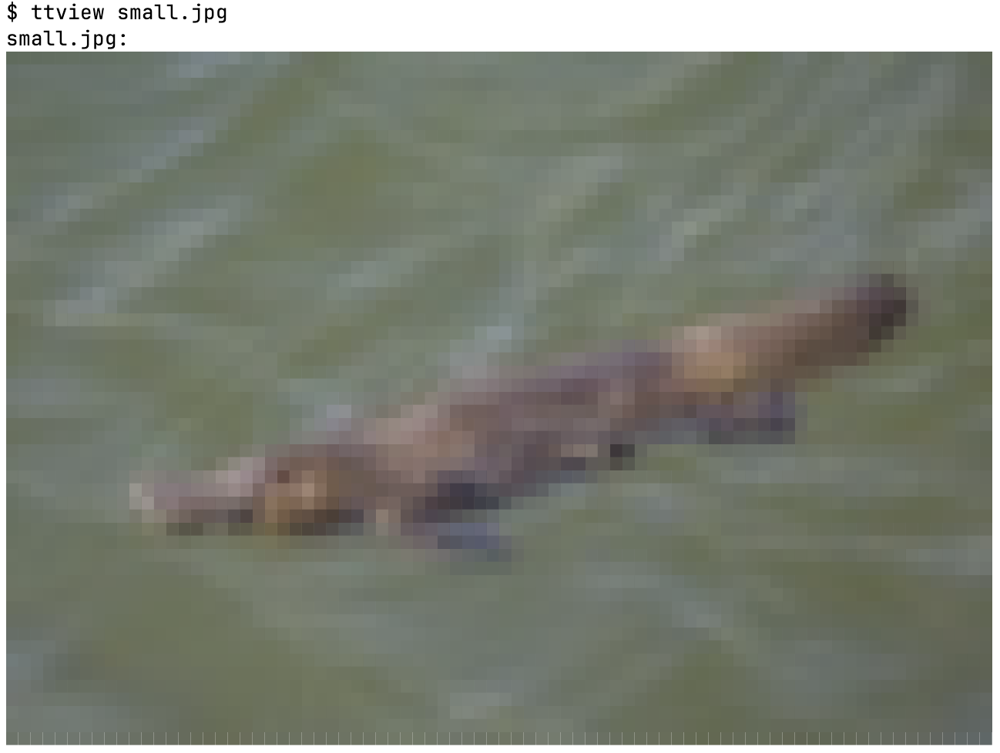

# TTView - Terminal Image Viewer

This application displays images by changing the text color and displaying U+2580 ("▀", Upper half block).
Images are resized to fit with a default width of 80 characters.

## Usage

Display an image: `ttview path/to/image`.  
Custom width: `ttview -w 100 path/to/image`
Default width is 80 characters.

## Inspiration & Credits

Inspiration: [Minecraft, but it runs in the terminal](https://www.youtube.com/watch?v=6zfXM-6yPJQ)
by [@zacoons](https://www.youtube.com/@zacoons) on YouTube.  
Test image of a platypus ([`small.jpg`](small.jpg)) taken
from [Wikipedia](https://en.wikipedia.org/wiki/File:Duck-billed_platypus_(Ornithorhynchus_anatinus)_Scottsdale.jpg),
taken by [Charles J. Sharp](https://www.wikidata.org/wiki/Q54800218) and distributed
under [CC BY-SA 4.0](https://creativecommons.org/licenses/by-sa/4.0/deed.en).

Thanks to [clap](https://crates.io/crates/clap), [image](https://crates.io/crates/image)
and [built](https://crates.io/crates/built) ❤️

## Contributing

If you have an idea how to improve this crate, go ahead and open an issue or create a pull request :D
